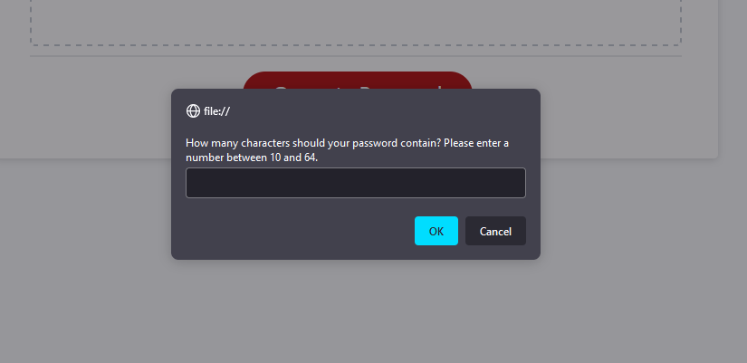

# Challenge 5 - Password Generator

## Table of Contents
1. [URL](#url)
2. [Description](#description)
3. [Installation](#installation)
4. [Usage](#usage)
5. [Credits](#credits)

## URL 

A live version of this page has been deployed at
https://spacepineapple.github.io/password-generator/

## Description 

This page was created as my solution to the fifth challenge task of a web
development bootcamp. For this task, I was provided with some starter code
consisting of an index.html file containing all of the basic HTML boilerplate, a
style.css containing all necessary styling and a script.js file. This JavaScript
file contained 4 arrays -- containing upper-case, lower-case, numeric and
special characters respectively -- a function designed to call another function
on click and also some other functions which were defined but empty.

My task for this particular challenge was to create a password generator that
would generate a random password when a button was clicked. However, the
password generator was also required to include certain functionality and to
place certain restrictions on the passwords which could be generated:
1. The page must prompt the user to set a length for the password.
2. The length must be between 10 and 64 characters inclusive.
3. The page must prompt the user and ask them if they wish to include lowercase
   characters in their password.
4. The page must prompt the user and ask them if they wish to include uppercase
   characters in their password.
5. The page must prompt the user and ask them if they wish to include numerical
   characters in their password.
6. The page must prompt the user and ask them if they wish to include special
   characters in their password.
7. The code should validate for each input and at least one character of each
   requested type must be included in the generated password.
8. After all prompts are answered, the password should be generated and either
   displayed in an alert or written to the page.

On first opening index.html, the browser page should resemble the following,
showing a heading, button and an empty window with no password: 

Upon clicking on the button, a series of prompts should be seen which resemble
the following: 

Finally, after completing all of the prompts the password generator should
generate and display the password in the empty window: 

## Installation 

All of the required files are included in this repository and no installation
should be required. The index.html file should render in any modern browser on
both a desktop or mobile device. 

## Usage 

To use this password generator, simply click the provided button and fill in the
prompts by typing a number in the provided textbox and selecting 'ok' or
'cancel' for each of the prompts. Note that any user must select a password
length between 10 and 64 characters inclusive and the user must also answer 'ok'
to at least one question regarding the characters to be used.

## Credits 

This project was completed by myself -- Neal Reeves. The index.html file,
style.css file and initial arrays and functions were provided by edX as part of
their Front End Web Development bootcamp.
